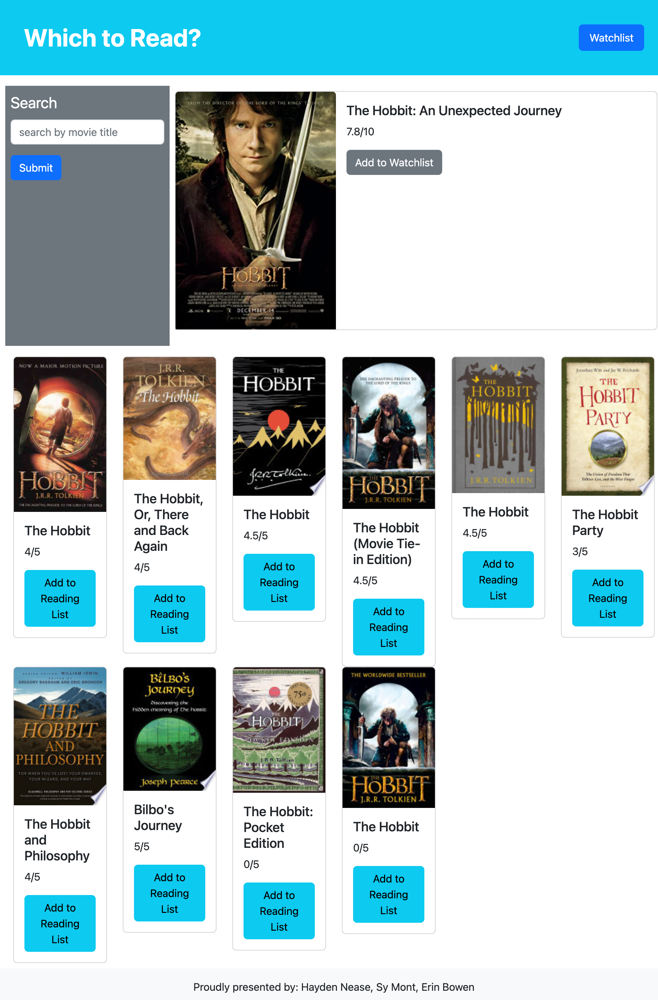

# Which to Read?
An app to help you pick the best version of a book a movie is based on.

[Link to this project's repository](https://github.com/Saidou25/Print-or-Film)

[Link to my project page]()

## Table of Contents
- [Description](#description)
- [Contributors](#contributors)
- [Resources](#resources)
- [Visuals](#visuals)

## Description
This web app is built with the intention that users can narrow down which version of a book to read before they watch a movie inspired by said book. Users will start with a simple search (with best advice being to search for the movie title) and be presented with a movie closest to their search. Below the movie will be a collection of related books, ranked in order by GoogleBooks user reviews. App users may then use a wishlist button for each book and/or movie they wish to review. These choices will be saved via local storage and kept in a wishlist for the user.

## Contributors
This project was brainstormed and brought to life by Hayden Nease, Sy Mont, and Erin Bowen.

## Resources
This project was created using [GoogleBooks](https://developers.google.com/books/docs/v1/using) and [OMBd](https://omdbapi.com/).

## Visuals

